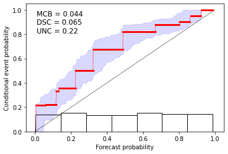

# CORP reliability diagram

Code to compute CORP reliability diagrams (see corresponding [paper](https://www.pnas.org/doi/10.1073/pnas.2016191118)) and [R package](https://cran.r-project.org/web/packages/reliabilitydiag/index.html).

Load the necessary functions


```python
from corp_functions import reliabilitydiag, reldiag
```

Load numpy to simulate some data


```python
import numpy as np
```


```python
n = 400
p1 = np.random.uniform(low=0.0, high=1.0, size=n)
ybin = np.random.binomial(1, np.sqrt(p1), n)
```

Compute reliability object and plot output


```python
rel_object = reliabilitydiag(p1, ybin)
```


```python
reldiag.corp_plot(rel_object)
```


    

    


Simulate discrete type of data


```python
import random
k = 10
p1 = np.asarray(random.choices((np.arange(k)+0.5) / k, k=n))
ybin = np.random.binomial(1, np.sqrt(p1), n)
```

Compute reliability object and plot output


```python
rel_object = reliabilitydiag(p1, ybin)

```


```python
reldiag.corp_plot(rel_object)
```


    

    

